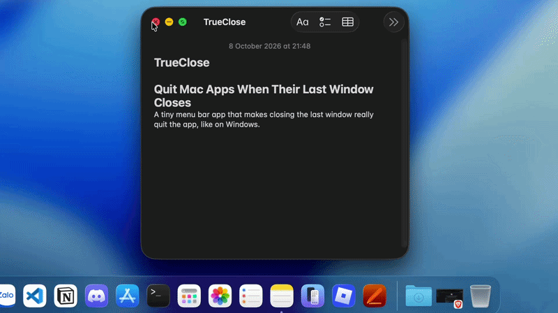
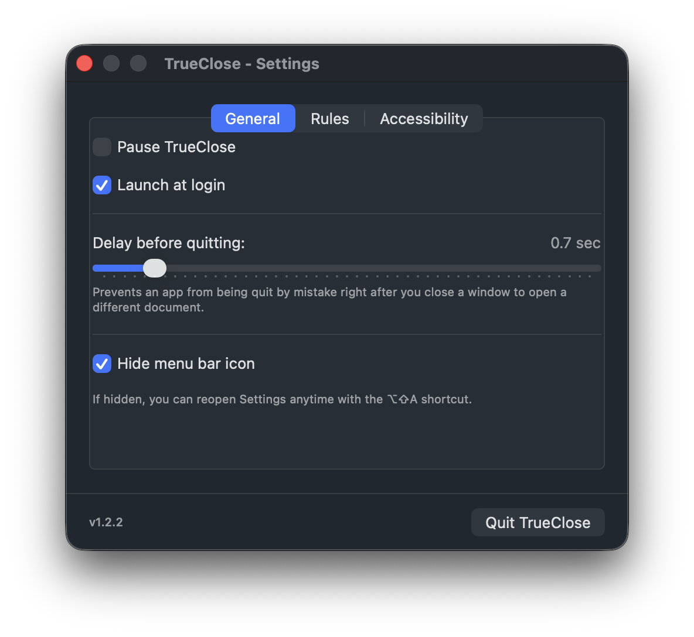

<div align="center">
    
    <h1>TrueClose — Quit Mac Apps When Their Last Window Closes</h1>
    <p>A tiny, free menu bar app for macOS that makes closing the last window really quit the app, like on Windows. Stop apps from lingering in the background and free up memory automatically.</p>
</div>

<div align="center">

[](https://github.com/nhatnam7kz/TrueClose/releases/latest)
[](https://github.com/nhatnam7kz/TrueClose/releases)

[](#install)
[](https://github.com/nhatnam7kz/TrueClose/stargazers)
[](https://github.com/nhatnam7kz/TrueClose/network/members)
[](LICENSE)

</div>

> [!NOTE]
> On macOS, clicking the red ✕ on an app's last window closes the window but **keeps the app running**. TrueClose quits it for you, so the Dock stays clean and idle apps stop using your RAM. Grab the latest build from the [releases page](https://github.com/nhatnam7kz/TrueClose/releases/latest).

> [!TIP]
> Some apps should keep running with no windows (music players, menu bar tools). Add them to the **Blacklist** in Settings and TrueClose will leave them alone.

## Features

- Automatically quits apps that have no windows left
- Configurable delay before quitting
- **Blacklist** (never quit these apps) or **Whitelist** (only quit these apps)
- Pause / Resume from the menu bar
- Launch at login
- Option to hide the menu bar icon

## Install

**Homebrew** (recommended — updates with `brew upgrade`):

```bash
brew install --cask nhatnam7kz/tap/trueclose
```

**Manual:**

1. Download `TrueClose.pkg` or `TrueClose.dmg` from the [latest release](https://github.com/nhatnam7kz/TrueClose/releases/latest).
2. `.pkg`: double-click and follow the installer. `.dmg`: open it and drag `TrueClose.app` into `/Applications`.
3. Clear the quarantine flag — TrueClose is not signed with a paid Apple certificate, so Gatekeeper would otherwise block the first launch:

```bash
xattr -d com.apple.quarantine /Applications/TrueClose.app
```

Prefer not to use Terminal? Right-click `TrueClose.app` → **Open** → **Open**. If macOS still refuses, go to **System Settings → Privacy & Security** and click **Open Anyway**.

Then open TrueClose and grant **Accessibility** in System Settings (see [Permissions](#permissions)).

## Permissions

TrueClose needs **Accessibility** permission to see how many windows an app has open.

On first launch, click **"Open System Settings to grant permission"**, then turn on TrueClose in **System Settings → Privacy & Security → Accessibility**.

## Usage

Click the TrueClose icon in the menu bar to **Pause/Resume**, open **Settings**, or **Quit**.

| Settings tab | What it does |
| --- | --- |
| **General** | Pause, launch at login, delay before quitting, hide the menu bar icon |
| **Rules** | Choose apps to exclude (Blacklist) or include (Whitelist) |
| **Accessibility** | Shows permission status |

> [!NOTE]
> If you hide the menu bar icon, you can reopen Settings anytime with the **⌥⇧A** shortcut.

## Build from source

```bash
git clone https://github.com/nhatnam7kz/TrueClose.git
cd TrueClose
./build.sh
```

This builds `TrueClose.app`, signs it, and packages both `TrueClose.dmg` and `TrueClose.pkg`. No extra steps needed.

## Uninstall

**Homebrew:**

```bash
brew uninstall --cask nhatnam7kz/tap/trueclose
```

**Manual:** quit TrueClose and delete it from `/Applications`.

To also remove its settings:

```bash
defaults delete com.trueclose.app
```

## Gallery

<table>
  <tr>
    <td align="center" valign="top" width="50%">
      <b>Close the last window, the app quits</b>
      <br><br>
      
      <br><br>
      Close an app's last window with the red button. After the short delay you set, the app quits completely and disappears from the Dock instead of staying open in the background.
    </td>
    <td align="center" valign="top" width="50%">
      <b>Simple settings</b>
      <br><br>
      
      <br><br>
      Pause TrueClose, set the delay before quitting, turn on launch at login, and hide the menu bar icon. The Rules tab manages your Blacklist / Whitelist.
    </td>
  </tr>
</table>

## Contributing

Contributions are welcome! If you find an app that doesn't quit (or quits when it shouldn't), please open an issue with the app's name.

## License

[MIT](LICENSE) — TrueClose is free and open-source.
